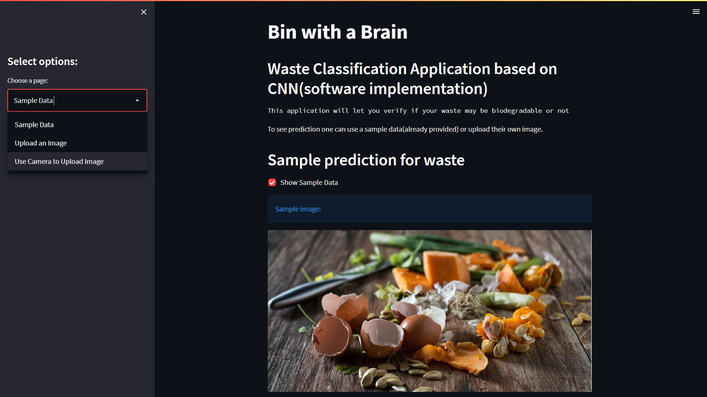

# Simulation Application with Streamlit

## General info

That is a simple Streamlit application with using a Deep Learning model to determine if a given waste are recyclable/non-biodegradable or organic/biodegradable. 
We used a pretrained CNN (Convolutional Neural Network) to detect waste. The code for building the CNN model is available [here](https://github.com/nightKnight112/Bin_with_a_Brain/blob/main/Model_p_final.ipynb).


## Technologies
Project is created with:

* Python 3.10.5
* libraries: streamlit, tensorflow, pillow.

**Running the app:**

To run this app install the required libraries by: 
```
pip install -r requirements.txt
```
or install the libraries using the following commands
```
pip install tensorflow
pip install keras
pip install streamlit
pip install pillow
```
Next download the project files to your system, then go to the folder/directory where these files reside and run the script:
```
streamlit run app.py
```


### Streamlit app preview:

